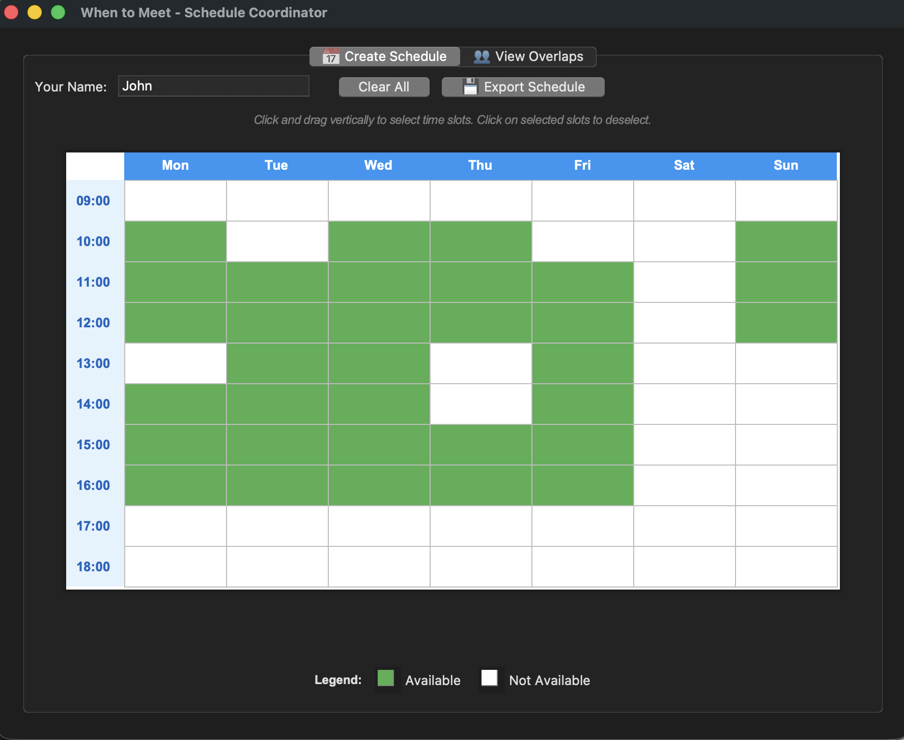

# Group Availability Planner

A lightweight desktop app for coordinating schedules across teams. Simple, local scheduling.




## Features

**Create Schedules**
- Drag to select availability (9 AM – 7 PM, Mon–Sun)
- Export as shareable TSV files

**Find Overlaps**
- Load multiple schedules at once
- Color-coded heatmap shows availability
- Click any slot to see who's free

**Smart Analytics**
- Best meeting times ranked by availability
- Per-person breakdown
- Day/hour pattern analysis

**Export to Calendar**
- Select final meeting times
- Export as iCal (.ics) with weekly recurrence
- Works with Apple Calendar, Google Calendar, Outlook

## Quick Start

```bash
python3 when_to_meet.py
```

**Requirements:** Python 3.8+ with tkinter (included on macOS/Windows; Linux: `sudo apt install python3-tk`)

## Workflow

1. **Each participant** creates their schedule → exports TSV
2. **Organizer** loads all TSV files → views overlaps
3. **Right-click** to select meeting times → export to iCal

## Why This?

| | Group Availability Planner | Online Tools |
|---|---|---|
| Privacy | 100% local | Cloud-based |
| Accounts | None needed | Required |
| Offline | ✓ | ✗ |
| Calendar Export | Native iCal | Limited |
| Cost | Free | Often freemium |
| Ease of Use | Medium | ✓ |

## PyInstaller app distribution guide:

###Windows:
pyinstaller --noconfirm --onefile --windowed --icon "images/app.ico" --name "GroupScheduler" "planner.py"

###MacOS:
pyinstaller --noconfirm --onedir --windowed --icon "images/app.icns" --name "GroupScheduler" "planner.py"

## License

This project is licensed under the MIT License - see the [LICENSE](LICENSE) file for details.